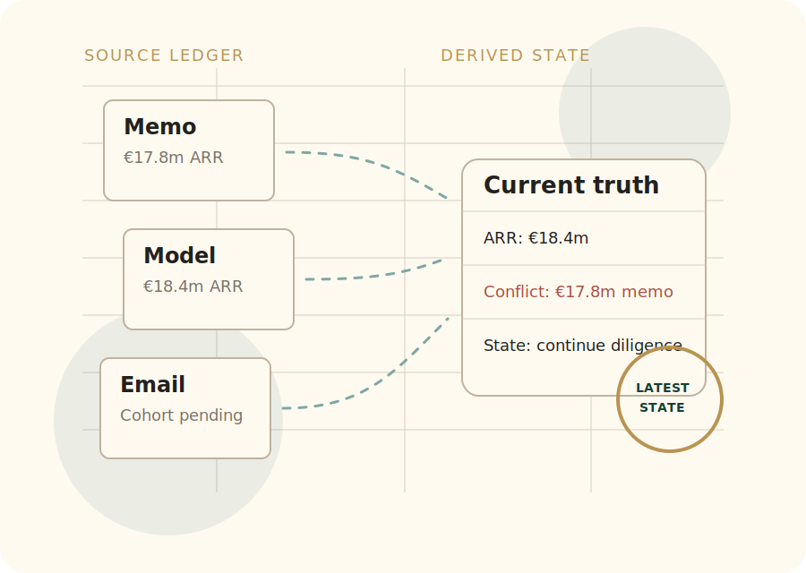
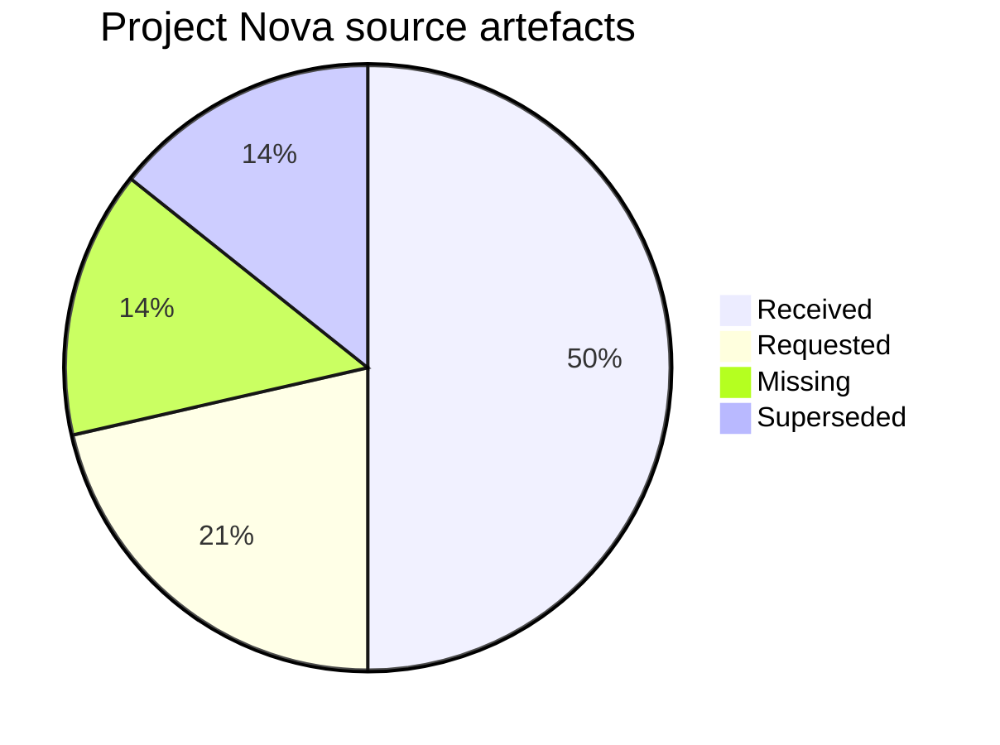
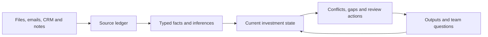
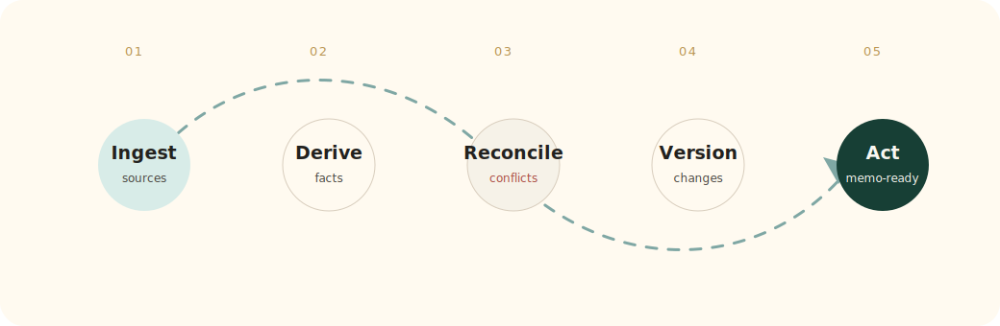
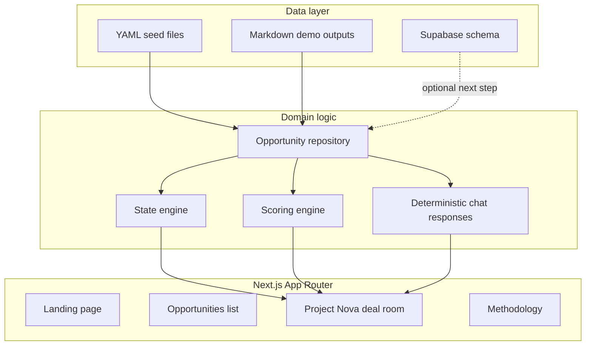

# DealState

Source-backed investment state for private-market deal teams.

[](https://dealstate-zeta.vercel.app)
[](https://dealstate-zeta.vercel.app/opportunities/project-nova)
[](package.json)
[](data/)

DealState is an archival state register for investment teams. It turns scattered files, emails, CRM updates, notes and generated work into a single, source-backed view of what the team knows, believes, questions and still needs.

It is deliberately not a document repository and not a generic chat-over-files demo. Documents are inputs. DealState is the investment state derived from those inputs.

**Live paths**

| Surface | Link | What to look at |
|---|---|---|
| Landing page | [dealstate-zeta.vercel.app](https://dealstate-zeta.vercel.app) | Product positioning, Humanist Compute Atelier visual system and core state loop |
| Demo deal | [/opportunities/project-nova](https://dealstate-zeta.vercel.app/opportunities/project-nova) | Fully populated synthetic deal room |
| Pipeline | [/opportunities](https://dealstate-zeta.vercel.app/opportunities) | State list with Project Nova plus thin synthetic deal shells |
| Methodology | [/methodology](https://dealstate-zeta.vercel.app/methodology) | Rules behind source-backed state derivation |



The current app uses a Humanist Compute Atelier direction: paper canvas, editorial serif type, sparse institutional navigation, source slips, provenance lines, marginalia and state-register cards. The previous dusk aesthetic is archived under [`docs/archive/dark-dealstate-aesthetic/`](docs/archive/dark-dealstate-aesthetic/).

## What It Does

DealState keeps the operating state of a deal visible:

| Product question | DealState answer |
|---|---|
| What is currently true? | A current state card with recommendation, confidence, source coverage and key metrics |
| What changed since the last review? | A timestamped change rail with evidence references |
| Which claims are supported? | A claims ledger that separates sourced facts, inferences, conflicts and unsupported assertions |
| What is missing before IC? | A document checklist and suggested request list |
| Where are the risks? | Open issue tables with severity, evidence and owner-style next actions |
| Can I ask the deal a question? | Deterministic opportunity-manager answers over the synthetic state |
| What can I reuse? | Generated outputs for onboarding, market mapping and theme work |

## Project Nova

Project Nova is the populated demo opportunity. All figures, people, files and companies are synthetic.

| Metric | Current demo state |
|---|---:|
| Source artefacts | 14 |
| Received artefacts | 7 |
| Missing or requested artefacts | 5 |
| Superseded artefacts | 2 |
| Open diligence issues | 5 |
| Derived key metrics | 5 |
| Firm scoring dimensions | 9 |
| Overall deal score | 61 |
| Source coverage | 46% |
| Generated outputs | 3 |



The intentionally useful bit is the tension in the state: ARR is reported at `EUR18.4m` in the May model and `EUR17.8m` in the IC memo draft, NRR is asserted without cohort evidence, EBITDA add-backs are unsupported, and customer concentration is not yet supplied. DealState keeps those issues visible rather than smoothing them into a confident paragraph.

## State Loop



```text
+-------------------+      +-------------------+      +-------------------+
| Source material   | ---> | State engine      | ---> | Deal room UI      |
| decks, models,    |      | facts, conflicts, |      | metrics, issues,  |
| notes, CRM        |      | coverage, scores  |      | outputs, chat     |
+-------------------+      +-------------------+      +-------------------+
          |                          |                          |
          v                          v                          v
   data/*.yaml              lib/state-engine.ts          app/opportunities/*
   content/demo/*           lib/scoring.ts               components/*
```

The product model is simple: make the durable object the state of the deal, not the latest uploaded file and not the latest chat answer.

## Deal Room Layout

Project Nova is arranged as a three-column workspace.

```text
+----------------------+  +--------------------------------------+  +----------------------+
| Workspace rail       |  | Current investment state             |  | Review rail          |
|                      |  |                                      |  |                      |
| Overview             |  | Recommendation and confidence        |  | Latest changes       |
| Metrics              |  | Key metrics with provenance          |  | Manager chat         |
| Claims               |  | Claims ledger                        |  | Document checklist   |
| Materials            |  | Open issues                          |  | Missing requests     |
| Issues               |  | Nine-dimension scorecard             |  | Generated outputs    |
| Questions            |  | Suggested next actions               |  | Contacts             |
| Outputs              |  |                                      |  |                      |
+----------------------+  +--------------------------------------+  +----------------------+
```

That structure is meant for the repeated, slightly messy workflow of private-market diligence: catch up, inspect what changed, check evidence, decide what to ask for next, and reuse the current state in a memo or briefing.

## Scorecard

Scores are directional, not decorative. Higher is more favourable. Risk dimensions therefore score mitigation, not exposure.

```text
ICP fit                  84 | #################...
Market attractiveness    72 | ##############......
Competition risk         63 | #############.......
Leadership risk          60 | ############........
Revenue quality          58 | ############........
Retention quality        55 | ###########.........
Diligence confidence     50 | ##########..........
AI disruption risk       46 | #########...........
Data completeness        40 | ########............
```

The overall Project Nova score is `61`, computed from weighted firm dimensions in [`data/scores.yaml`](data/scores.yaml) by [`lib/scoring.ts`](lib/scoring.ts).

## Trust Model

DealState is built around a few non-negotiables:

| Rule | How the app shows it |
|---|---|
| Sources are preserved | Every material metric carries a citation, inference marker or unsupported state |
| Conflicts stay visible | Conflicting values are shown as conflicts until reconciled |
| Missing material is state | Absent artefacts become open requests, not private analyst memory |
| Chat is not the source of truth | Chat answers are deterministic in pass 1 and cite the same state ledger |
| Synthetic means synthetic | The demo makes no claim about a real company, market or transaction |



The visual system uses an archival paper tone: calm, source-backed and closer to an investment casebook than a generic SaaS dashboard.

## Architecture



**Current default:** `USE_SUPABASE=false`, which serves validated YAML through [`SeedRepository`](lib/repo/SeedRepository.ts).

**Optional path:** Supabase tables and RLS are scaffolded in [`supabase/migrations/20260621190524_init.sql`](supabase/migrations/20260621190524_init.sql), but full aggregate hydration in [`SupabaseRepository`](lib/repo/SupabaseRepository.ts) remains a pass-1 next step.

## Pass 2 Data Plane

Pass 2 adds the real data-plane foundations behind the same UI contract. The dashboard still reads through [`OpportunityRepository`](lib/repo/OpportunityRepository.ts), so seed mode and the public Project Nova demo remain stable.

| Stage | Current implementation |
|---|---|
| Tenancy | Firm, fund, deal and membership schemas plus a deny-by-default RLS migration in [`supabase/migrations/20260630090000_pass2_foundations.sql`](supabase/migrations/20260630090000_pass2_foundations.sql) |
| Ingestion | `SourceAdapter`, in-memory ingestion runner, content-hash dedupe, supersession marking and Gmail OAuth stub in [`lib/ingest/`](lib/ingest/) |
| Parsing | Deterministic segment parser with stable email, CSV and spreadsheet-text locators in [`lib/parse/`](lib/parse/) |
| Extraction | Citation verification and candidate materialisation into existing `Fact` records in [`lib/citations.ts`](lib/citations.ts) and [`lib/extract/`](lib/extract/) |
| Retrieval | RLS-aware hybrid retrieval fusion helper in [`lib/retrieve/`](lib/retrieve/) |
| Grounding | Grounded answer validation with abstention on missing evidence in [`lib/generate/`](lib/generate/) |
| Evals | Offline Project Nova fixtures, gold labels and `npm run eval` under [`evals/`](evals/) and [`scripts/eval.ts`](scripts/eval.ts) |

The live Gmail connector, hosted Supabase branch database, live model transport and preview deployment require account credentials. Until those exist, the public demo stays on the synthetic tenant and the live-only code paths fail closed with `TODO(pass2):` markers.

## Repository Map

| Path | Purpose |
|---|---|
| [`app/`](app/) | Next.js routes, metadata, sitemap and robots |
| [`components/`](components/) | Landing, navigation, deal room, chart and shared UI components |
| [`data/`](data/) | Synthetic Project Nova state, documents, facts, issues, scores, events and contacts |
| [`content/demo/project-nova/`](content/demo/project-nova/) | Generated Markdown outputs shown in the product |
| [`lib/state-engine.ts`](lib/state-engine.ts) | Current state, source coverage and change derivation |
| [`lib/scoring.ts`](lib/scoring.ts) | Weighted deal score calculation |
| [`lib/repo/`](lib/repo/) | Seed and optional Supabase repository boundary |
| [`scripts/`](scripts/) | YAML validation and copy linting |
| [`docs/archive/dark-dealstate-aesthetic/`](docs/archive/dark-dealstate-aesthetic/) | Archived pre-overhaul dusk aesthetic, screenshots and restoration notes |
| [`public/graphics/`](public/graphics/) | Source-to-state SVG graphics used by the Humanist Compute Atelier surface |
| [`BUILD-REPORT.md`](BUILD-REPORT.md) | Last full implementation and deployment report |

## Run Locally

Prerequisites:

- Node.js 22 or later
- npm
- `gitleaks` if you are using the repo hooks

```bash
npm ci
```

```bash
cp .env.example .env.local
```

```bash
npm run dev
```

Open:

```text
http://localhost:3000/opportunities/project-nova
```

Seed mode needs no external service. To point the app at Supabase later, apply the migration, seed equivalent rows, set the public Supabase URL and publishable key, and set `USE_SUPABASE=true`.

## Verification

The normal quality gate is:

```bash
npm run validate
```

That runs:

```text
validate-data -> lint:copy -> typecheck -> lint -> test
```

For a production build:

```bash
npm run build
```

For the deterministic pass-2 eval:

```bash
npm run eval
```

The last recorded full release check is in [`BUILD-REPORT.md`](BUILD-REPORT.md). It covers validation, tests, static generation, route smoke checks, desktop and mobile browser QA, Lighthouse checks, Vercel deployment, remote HTTP smoke checks and log inspection.

## Deployment

The public demo currently runs on Vercel:

```text
https://dealstate-zeta.vercel.app
```

Useful production routes:

```text
/
/opportunities
/opportunities/project-nova
/methodology
/opportunities/project-nova/outputs/onboarding-brief
```

## Synthetic Boundary

Everything in Project Nova is synthetic and centralised under [`data/`](data/) and [`content/demo/`](content/demo/). The repo currently demonstrates product shape, state discipline and UI integrity. It does not yet run live ingestion, retrieval, model calls or real customer data.

The next high-value steps are:

1. Implement full Supabase aggregate hydration.
2. Add real ingestion adapters for files, email and CRM records.
3. Replace deterministic chat with structured, cited model outputs.
4. Add evaluation fixtures for extraction, conflict detection and answer grounding.
5. Add row-level permission boundaries for firm, fund, deal and user scopes.

## Why This Exists

Most deal tools make teams choose between static files, fragile trackers and chat answers that are hard to audit. DealState takes the other route: keep the source ledger, derive the investment state, expose the gaps, and make the current view easy to inspect.

That is the wedge: one live state for every deal.
